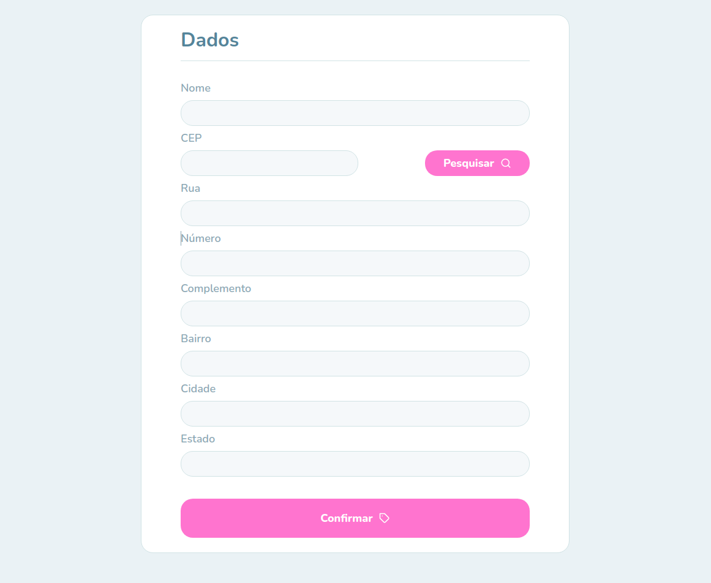

<h1 align="center">
  Tag-maker-correios
   
   
  
</h1>

<h3 align="center">
  Simple page to create mail labels.
</h3>

  
  
  
  
  

  <a href="#-about">About</a>&nbsp;&nbsp;&nbsp;|&nbsp;&nbsp;&nbsp;
  <a href="#-layout">Layout</a>

## 🔗 About

Simple project developed to send mail labels from my mother's company.

## 🔖 Layout

  

---

&nbsp

